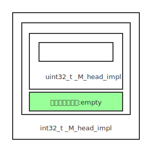

## 背景

上周发现了一个问题, 在Linux下, 元组中空类型元素指针和最后一个元素的指针相同, Windows则不会, 指针各自不同, 下面的示例代码:


#include <cstdint>
#include <cstdio>
#include <tuple>

struct empty {};

int main()
{
    std::tuple<int32_t, empty, uint32_t> exmaple;
    printf("sizeof(exmaple)=%zu\n", sizeof(exmaple));
    printf("0 ptr=%p offset=%td\n", &std::get<0>(exmaple), (char*)&std::get<0>(exmaple) - (char*)&exmaple);
    printf("1 ptr=%p offset=%td\n", &std::get<1>(exmaple), (char*)&std::get<1>(exmaple) - (char*)&exmaple);
    printf("2 ptr=%p offset=%td\n", &std::get<2>(exmaple), (char*)&std::get<2>(exmaple) - (char*)&exmaple);
    return 0;
}


MSVC运行结果(VS2019):


sizeof(exmaple)=12
0 ptr=0000000F7E58F850 offset=8
1 ptr=0000000F7E58F84C offset=4
2 ptr=0000000F7E58F848 offset=0


GCC运行结果(GCC4.8/GCC9)


sizeof(exmaple)=8
0 ptr=0x7ffd6437c214 offset=4
1 ptr=0x7ffd6437c210 offset=0
2 ptr=0x7ffd6437c210 offset=0


## 背景知识

在分析这个问题之前, 需要先了解一些C++基础知识:

* 和C不同, 在C++下, 空类的大小不会为0, 在很多平台上, 其大小为1。
* C++的设计者们不允许类的大小为0，其原因很多。比如由它们构成的数组，其大小必然也是0，这会导致指针运算中普遍使用的性质失效。
* 虽然不能存在“零大小”的类，但这扇门也没彻底关死。C++标准规定，当空类作为基类时，只要不会与同一类型的另一个对象或子对象分配在同一地址，就不需为其分配任何空间。

我们下面代码, 演示一下上面的描述:


#include <cstdio>
struct empty {};
struct non_empty
{
    int i;
};
struct derived1 : public empty 
{
    int i;
};
struct derived2 : public empty, non_empty{};
int main()
{
    printf("sizeof(empty)=%zu\n", sizeof(empty)); // sizeof(empty)=1
    printf("sizeof(non_empty)=%zu\n", sizeof(non_empty)); // sizeof(non_empty)=4
    printf("sizeof(derived1)=%zu\n", sizeof(derived1)); // sizeof(derived1)=4
    printf("sizeof(derived2)=%zu\n", sizeof(derived2)); // sizeof(derived2)=4
    return 0;
}


## MSVC 元组实现

MSVC的元组实现, 是教科书的元组实现, 中规中矩. 以下代码选摘自MSVC的tuple文件:


template <class _Ty>
struct _Tuple_val { // stores each value in a tuple
    _Ty _Val;
};

template <class... _Types>
class tuple;

template <>
class tuple<> { // empty tuple
};

template <class _This, class... _Rest>
class tuple<_This, _Rest...> : private tuple<_Rest...> { // recursive tuple definition
public:
    _Tuple_val<_This> _Myfirst; // the stored element
};


C++11引入了变长模板参数, 上面代码中, 

`template <class... _Types>class tuple;`是变长类模板的声明, 在标示符_Types之前的使用了省略号（三个“点”）来表示该参数是变长的。_Types被称作是一个“模板参数包”（template parameter pack）。

如何使用模板参数包呢? 思路是使用数学的归纳法，转换为计算机能够实现的手段则是递归。

通过定义递归的模板偏特化定义，我们可以使得模板参数包在实例化时能够层层展开，直到参数包中的参数逐渐耗尽或到达某个数量的边界为止。

用上文中的代码解释:

* `template <class _This, class... _Rest> class tuple<_This, _Rest...> : private tuple<_Rest...>` 递归的偏特化定义.
* `template <>class tuple<>` 偏特化, 边界条件

我们在示例中的`std::tuple<int32_t, empty, uint32_t>`, 在MSVC下, 会被解释成:

按照这个实现, 很容易理解为何在MSVC下 `sizeof(exmaple)=12`, 以及元组的每一个元素都有不同的指针.

## GCC 元组实现

GCC的元组针对空数组, 又做了处理, 以下代码选摘自GCC的tuple文件, 太长了, 分成三部分来看:

* 第一部分, `tuple`


  /// Primary class template, tuple
  template<typename... _Elements> 
    class tuple : public _Tuple_impl<0, _Elements...>
    {
    }


以上代码说明, tuple继承自_Tuple_impl. 

* 第二部分, `_Tuple_impl`


  template<std::size_t _Idx, typename... _Elements>
    struct _Tuple_impl; 

  template<std::size_t _Idx>
    struct _Tuple_impl<_Idx>
    {
    };

  template<std::size_t _Idx, typename _Head, typename... _Tail>
    struct _Tuple_impl<_Idx, _Head, _Tail...>
    : public _Tuple_impl<_Idx + 1, _Tail...>,
      private _Head_base<_Idx, _Head, __empty_not_final<_Head>::value>
    {
    };


以上是_Tuple_impl的声明和偏特化的实现, 和MSVC实现的显著不同点是使用了多重继承, 而非成员变量的方式.

`__empty_not_final`是一个traits , 当非final的empty类/结构时返回true, 否则flase.

* 第三部分, `_Head_base`


  template<std::size_t _Idx, typename _Head, bool _IsEmptyNotFinal>
    struct _Head_base;

  template<std::size_t _Idx, typename _Head>
    struct _Head_base<_Idx, _Head, true>
    : public _Head
    {
    };

  template<std::size_t _Idx, typename _Head>
    struct _Head_base<_Idx, _Head, false>
    {
      _Head _M_head_impl;
    };


最后是_Head_base的实现, 有两个偏特化, 当`_IsEmptyNotFinal`为true时(即 非final的空类型时)时, 采用继承的方式, 否则采用成员变量的方式.

我们在示例中的`std::tuple<int32_t, empty, uint32_t>`, 在GCC下, 会被解释成:

按照这个实现, 可以理解为何在GCC下 `sizeof(exmaple)=8`, 以及空类型元素的指针和最后一个元素的指针相同.

## 参考书目

* 《C++ Templates中文版》16.2.1 布局原则
* 《深入理解C++11》6.2.2 变长模板