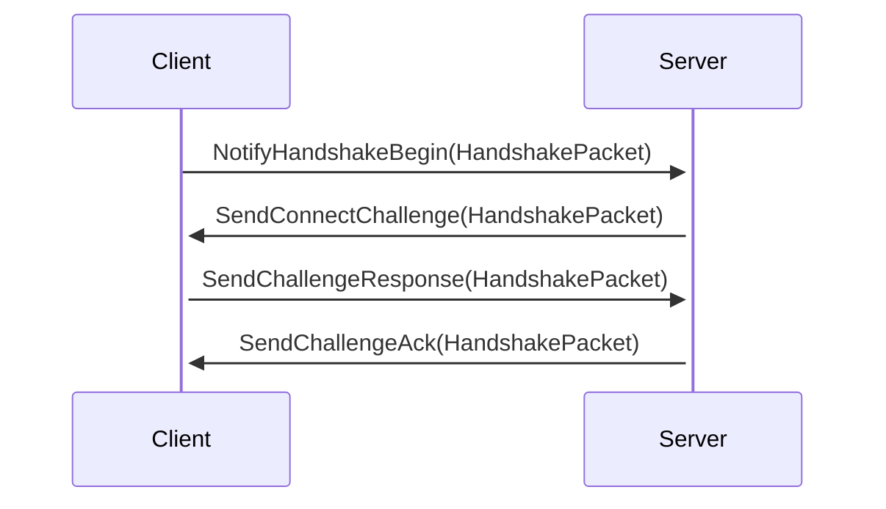
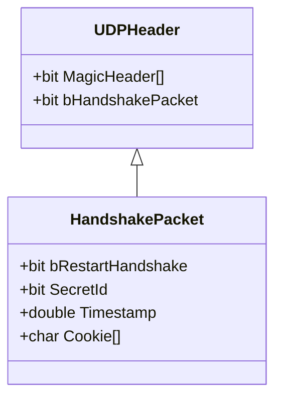
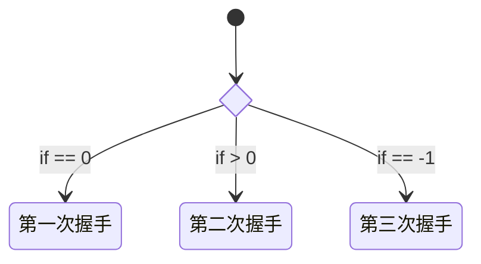
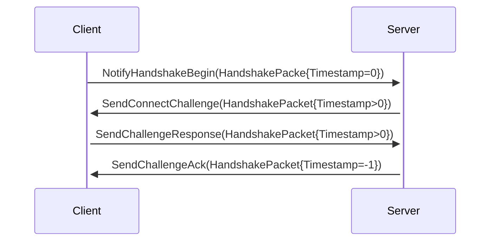
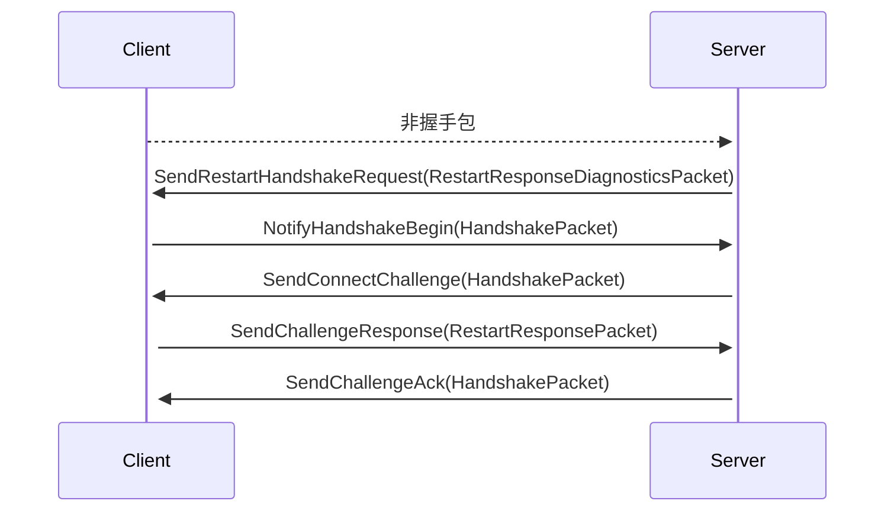
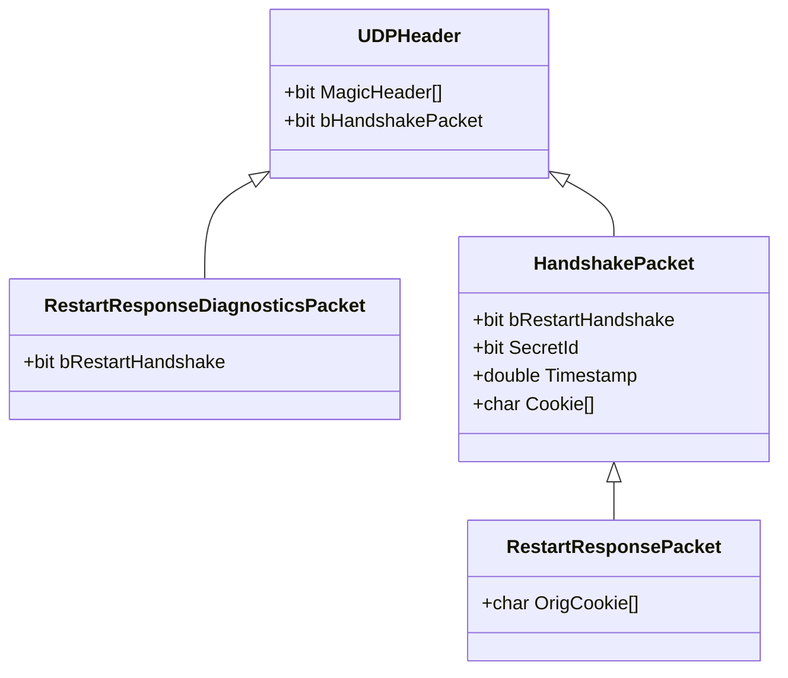

## 建立连接

UDP是无连接的协议, 可靠传输的前提是要建立连接, 所以在应用程序上模拟三次握手, 建立连接.



握手包数据结构如下



服务端实现了无状态的握手处理模块, 
通过[HMAC算法](https://en.wikipedia.org/wiki/HMAC)来校验`Cookie`是否正确:
```
Cookie=HMAC(SecretId, Timestamp, IP:Port)
```
校验通过后则进入下一个握手状态, 通过`Timestamp`的不同数值, 标识握手的三个状态.



回到时序图, 状态如下:



当服务器发送SendChallengeAck时, 会同时在服务器创建连接, 当客户端收到ChallengeAck时, 认为连接成功.


## 迁移连接

服务器收到来自未知地址的UDP数据, 但不是握手包(`bHandshakePacket==0`), 则触发再次握手的请求.



和建立连接不同点是, 当SendChallengeResponse时, 发送的数据包类型为**RestartResponsePacket**, 
客户端收到**RestartResponsePacket**后切换状态为断线状态, 并重新发起握手.



`RestartResponsePacket`比`HandshakePacket`多了`OrigCookie`, 
当服务器`SendChallengeAck`后, 通过`OrigCookie`寻找之前的连接, 将地址与之前的连接进行关联.
客户端收到SendChallengeAck后, 恢复为连接状态.
