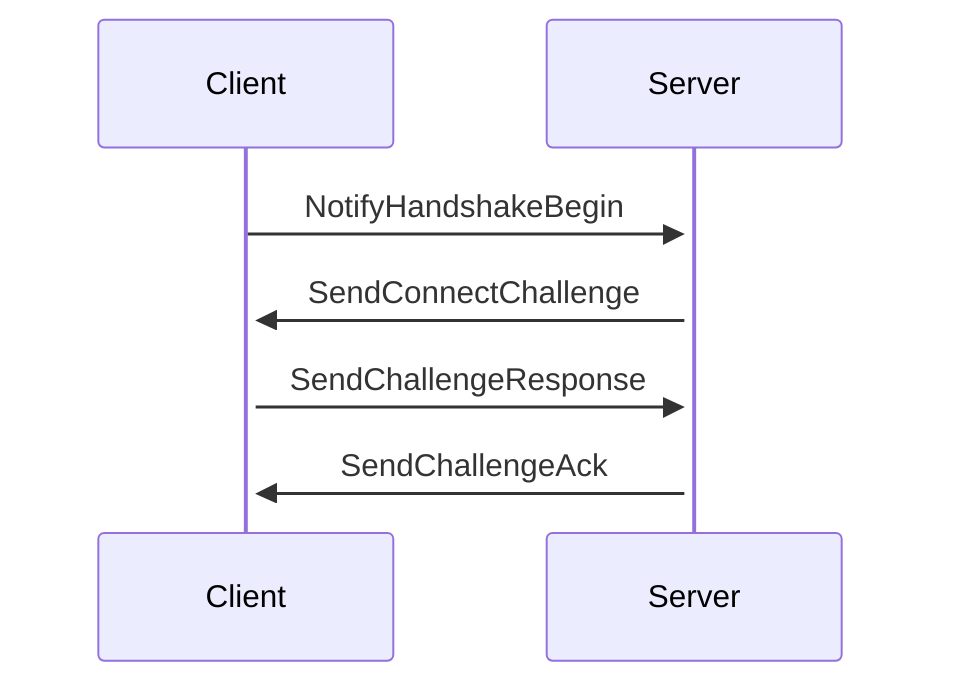
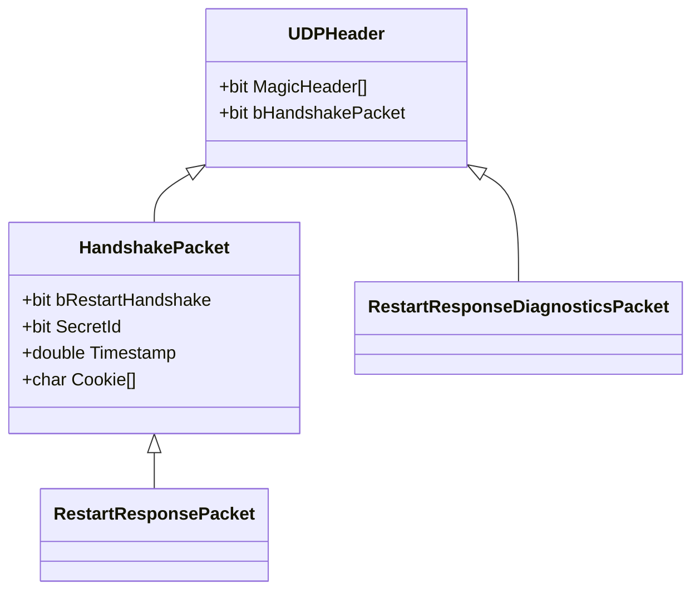
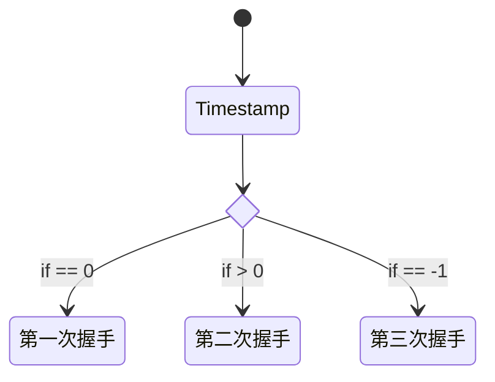
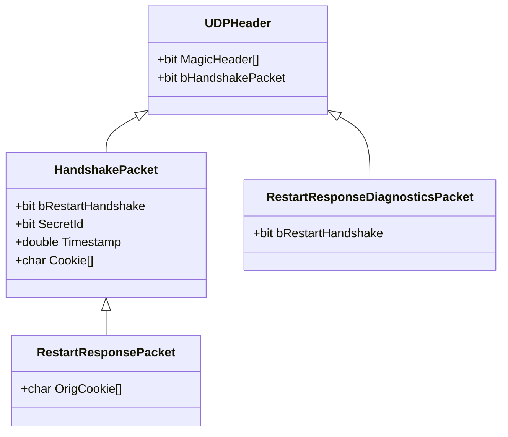

UDP是无连接的协议, 可靠传输的前提是要建立连接, 所以在应用程序上模拟三次握手, 建立连接.

握手包数据结构如下

服务端实现了无状态的握手处理模块, 
通过[HMAC算法](https://en.wikipedia.org/wiki/HMAC)来校验`Cookie`是否正确(`Cookie=HMAC(SecretId, Timestamp, IP:Port)`).
通过`Timestamp`的不同数值, 表示握手的三个状态.

完整数据结构

