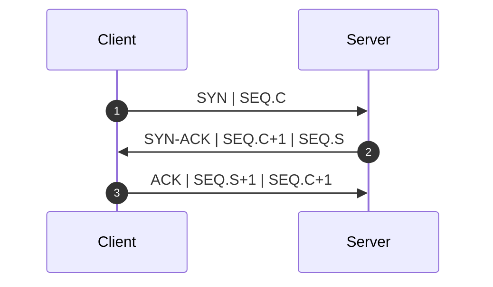
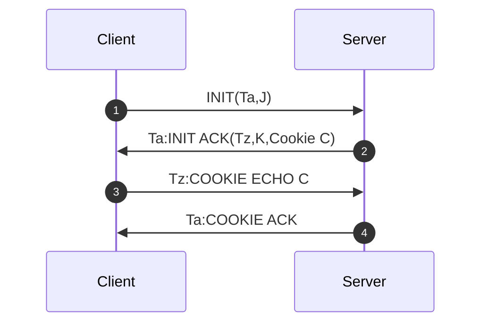
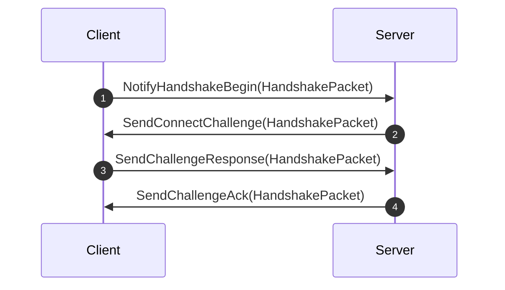
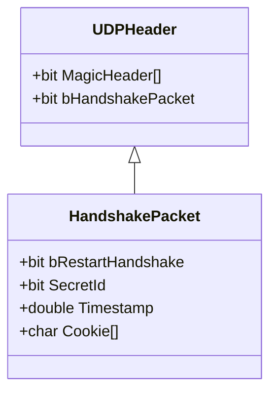
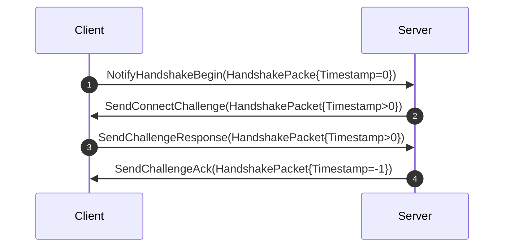
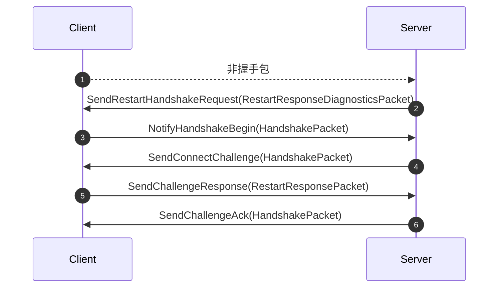
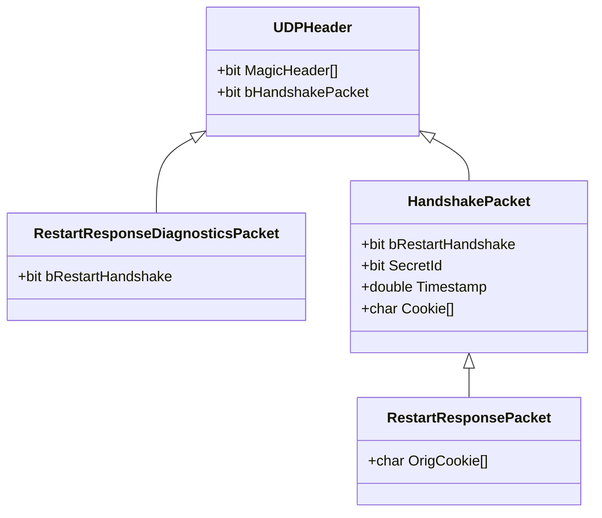

## 背景

建立连接需要进行握手, 常见的方案有如下几种:
* TCP三次握手
* STCP四次握手
* QUIC 1RTT握手(这个需要篇幅较大, 有兴趣自查资料)

### TCP三次握手



1. 客户端调用connect函数, 发送SYN
1. 服务器发送SYN-ACK
1. 客户端connect函数返回, 客户端连接创建成功
1. 服务器accept函数返回, 服务端连接创建成功

Tcp的三次握手的问题是可能存在`SYN Flood 攻击`漏洞, 因为服务端接收到`SYN`后, 有的TCP实现会分配资源, 从而造成服务器性能下降.

### STCP四次握手


1. 客户端调用connect函数
1. 服务器发送状态Cookie
1. 客户端发送状态Cookie, 服务器接收后accept函数返回, 服务端连接创建成功
1. 客户端connect函数返回, 客户端连接创建成功

## Unreal传输层协议建立连接

Unreal传输层协议采用了类似STCP四次握手的方案.





服务器监听UDP端口, 当收到UDP数据后, 查询是否该地址已经建立过连接, 如果没有, 则进入握手处理模块.

1. 客户端创建连接后, 主动发送`NotifyHandshakeBegin`
1. 服务器收到后, 产生`Cookie`并通过`SendConnectChallenge`发送客户端
1. 客户端通过SendChallengeResponse返回`Cookie`, 服务器收到后建立连接
1. 服务器发送`SendChallengeAck`, 客户端收到后建立连接

为了防止DDOS攻击, 服务器实现了无状态的处理握手模块, 
通过`HandshakePacket.Timestamp`的不同数值, 标识握手的三个状态.


将状态信息补充到时序图:



服务器在第2阶段通过[HMAC算法](https://en.wikipedia.org/wiki/HMAC)生成`Cookie`, 
在第3阶段校验客户端上行的`Cookie`是否相同, 校验通过后服务端创建连接.

```
Cookie=HMAC(SecretId, Timestamp, IP:Port)
```

## 迁移连接

服务器收到来自未知地址的UDP数据, 但不是握手包(`bHandshakePacket==0`), 则触发再次握手的请求.



和建立连接不同点是, 当SendChallengeResponse时, 发送的数据包类型为**RestartResponsePacket**, 
客户端收到**RestartResponsePacket**后切换状态为断线状态, 并重新发起握手.



`RestartResponsePacket`比`HandshakePacket`多了`OrigCookie`, 
当服务器`SendChallengeAck`后, 通过`OrigCookie`寻找之前的连接, 将地址与之前的连接进行关联.
客户端收到SendChallengeAck后, 恢复为连接状态.

## 丢包处理
