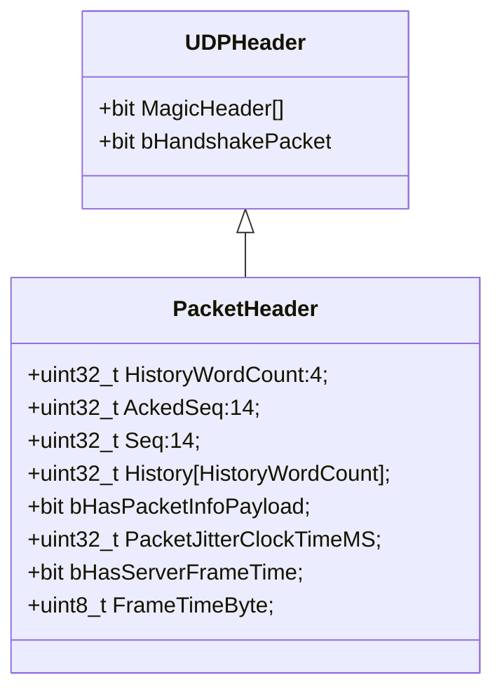
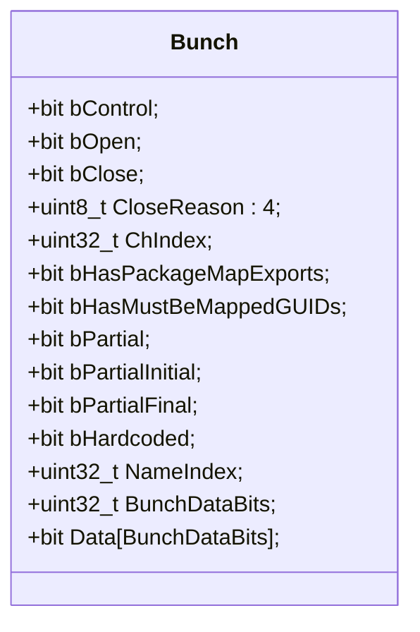

Unreal传输层是支持多路复用的, 每一条通路称为一个Channel, Channel之间数据不互相堵塞.

建立连接后, 服务器和客户端通过Cookie的前四个字节, 转化为服务器和客户端的序号(Seq).

```
int16_t* CurSequence = (int16_t*)Cookie;
int32_t LastServerSequence = *CurSequence & (MAX_PACKETID - 1);
int32_t LastClientSequence = *(CurSequence + 1) & (MAX_PACKETID - 1);
```
以此来判断是不是有数据包丢失, 当收到数据包时, 



会根据Seq是收包的序号, 通过和之前的收到的序号(`FNetPacketNotify::InSeq`)计算差值(注意要考虑溢出问题), 有三种情况:

* 小于1: 该Packet属于重复收包或者已经处理过后续包了, 直接丢弃
* 等于1: 当前需要处理的数据包
* 大于1: 先缓存, 待下一个包处理后, 再次检查是否等于1, 缓存一段时间后如果依旧不连续, 则将这一段时间缓存的包, 按照Seq的排序后进行执行

数据包由多个Bunch组成,


Bunch的序列化数据中存在大量的位操作, 以及采用额外的标志位, 减少整体的传输, 比如说对于某个Channel而言, 通常只有一个Bunch的bOpen=1包, 一个bClose=1的包,和N个bOpen=0且bClose=0等于0的包,
如果使用一个bControl字段, 当bOpen和bClose有一个为1时, 存储三位, 分别标识bControl=1, bOpen=0/1, bClose=0/1, 当都为0时, 仅存储bControl=0, 则大多数情况下能节省流量.