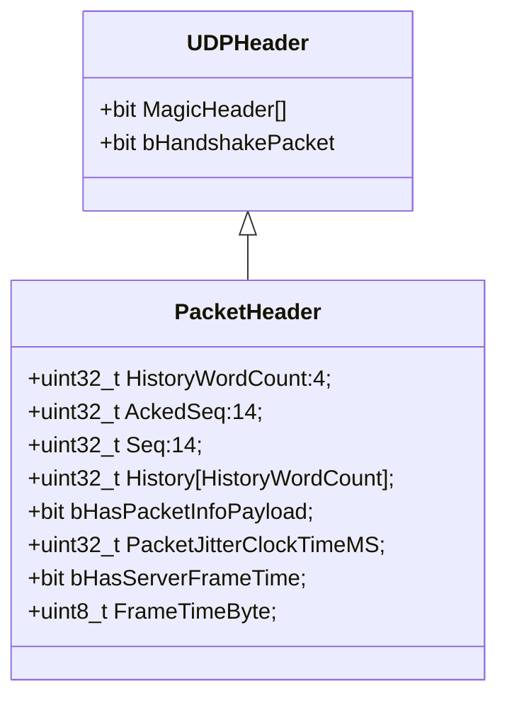
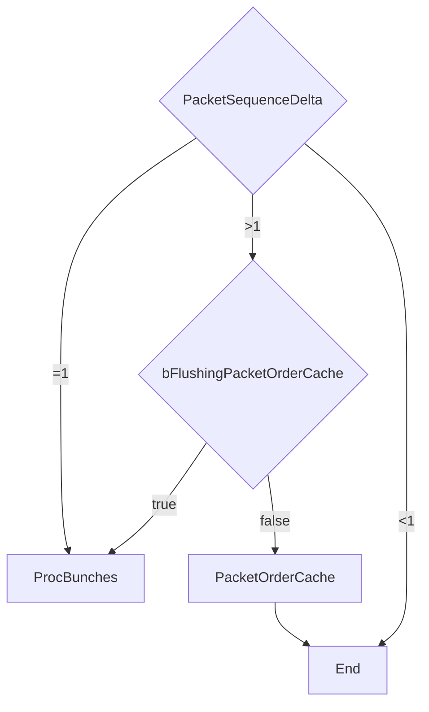
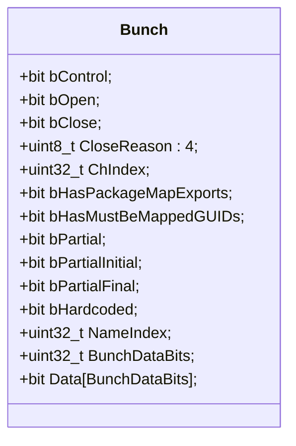

Unreal传输层抽象了几个名词:

* UNetConnection: 代表客户端和服务器的一条连接, 建立连接后, 客户端/服务器都会有对应的UNetConnection的对象
* UChannel: UNetConnection中有多个UChannel, UChannel之间数据不互相堵塞, 以此实现多路复用.
* Bunch: UChannel 接收和发送的数据类型, 由BunchHeader和Data组成, UChannel可以有自己的的编码协议(即Data的编解码由Channel决定)
* Packet: UNetConnection发送和接收的数据, 由PacketHeader和多个Bunch组成

当建立连接后, 服务器和客户端通过Cookie的前四个字节, 转化为服务器和客户端的序号(Seq), 收到和发送的Packet的序列号将以此开始.

```
int16_t* CurSequence = (int16_t*)Cookie;
int32_t LastServerSequence = *CurSequence & (MAX_PACKETID - 1);
int32_t LastClientSequence = *(CurSequence + 1) & (MAX_PACKETID - 1);
```

## Packet收包流程



当接收到一个Packet包时, PacketHeader中的Seq是包的序号, 和UNetConnection之前的收到的序号(`FNetPacketNotify::InSeq`)计算差值PacketSequenceDelta(*注意要考虑溢出问题*):



1. 当`PacketSequenceDelta=1`, 进入Bunches处理阶段
1. 当`PacketSequenceDelta<1`, 已经处理过该包或者更新的包, 直接丢弃
1. 当`PacketSequenceDelta>1`, 存在丢包, 此时分为两种情况:
    * 如果在收包阶段, 把包加入包有序缓存队列`PacketOrderCache`
    * 如果是清空有序缓存队列阶段(`bFlushingPacketOrderCache == true`), 进入Bunches处理阶段

## Bunch收包流程



Bunch的序列化数据中存在大量的位操作, 以及采用额外的标志位, 减少整体的传输, 比如说对于某个Channel而言, 通常只有一个Bunch的bOpen=1包, 一个bClose=1的包,和N个bOpen=0且bClose=0等于0的包,
如果使用一个bControl字段, 当bOpen和bClose有一个为1时, 存储三位, 分别标识bControl=1, bOpen=0/1, bClose=0/1, 当都为0时, 仅存储bControl=0, 则大多数情况下能节省流量.